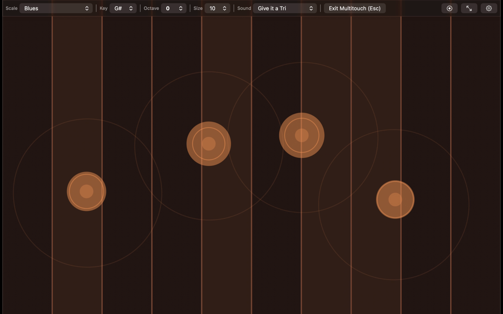

  

<h1 align="center">Etherpad</h1>

<b>An expressive multi-touch synthesizer</b>

  Play ethereal music with your own touch — iPhone, iPad, Mac, and Android.      
  Every finger is its own voice — slide, hold, lift ... the music follows your gesture in real time.   No setup, no MIDI, no music theory required. Just open and play.

  
  
  

## Features

- **Multi-touch synthesis** — every finger plays its own voice
- **5 sound modes** — from lush pads to gritty leads
- **12 musical scales** — Major, Minor, Pentatonic, Blues, Whole-Tone, Chromatic, Octatonic, Bohlen-Pierce, Flamenco, two Overtone Series, and the original Etherpad default
- **Adjustable key, octave, and grid size** (4–14 notes per row)
- **Optional visual effects** — ripples, finger trails, intensity rings, pitch-column glow
- **iPad split-screen mode** — play two independent synths side-by-side
- **Low-latency audio** — optimized for live performance

### iPad — plugin

- **AUv3 instrument** — run inside **GarageBand**, **AUM**, **Cubasis**, and other hosts
- **MIDI input** — play from the host keyboard (pad-emulation mapping)
- **MIDI output** — route touch performance to other tracks (e.g. in AUM)

Note: Standalone on iPhone, iPad, and Mac needs no host. AUv3 is for DAW-style workflows on iPad.

## App Preview

  

  

<i>Etherpad AUv3 in GarageBand — touch synth layered with drums and instruments · <a href="https://youtu.be/RAIrqaHr3FI">Watch on YouTube</a></i>

## Contributing

Contributions and ideas are welcome! See [CONTRIBUTING.md](CONTRIBUTING.md).

## Credits

Etherpad is inspired by the original Android app **EtherSurface**, created by **[Paul Batchelor](https://paulbatchelor.github.io/about/)** in 2014.

- Sound engine — [Csound](https://www.csound.com) by Barry Vercoe, Victor Lazzarini, et al.

## License

Application code © Dinesh (HumbleBee). Released under **GPLv3**.

See [NOTICE.md](NOTICE.md) for full attributions.