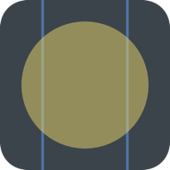

  

<h1 align="center">Etherpad</h1>

<b>An expressive multi-touch synthesizer for iPhone, iPad, Mac, and Android.</b>

  Touch anywhere to make sound — every finger is an independent voice, driven by a professional
  <a href="https://www.csound.com">Csound</a> engine. Slide, hold, lift; the music follows your gesture
  in real time. No setup, no MIDI, no music theory required. Open and play.

  
  
  

## Features

- **Multi-touch synthesis** — every finger plays its own voice
- **5 sound modes** — from lush pads to gritty leads
- **12 musical scales** — Major, Minor, Pentatonic, Blues, Whole-Tone, Chromatic, Octatonic, Bohlen-Pierce, Flamenco, two Overtone Series, and the original Etherpad default
- **Adjustable key, octave, and grid size** (4–14 notes per row)
- **Optional visual effects** — ripples, finger trails, intensity rings, pitch-column glow
- **iPad split-screen mode** — play two independent synths side-by-side on iPad
- **Low-latency audio** — optimized for live performance

## Repository layout

This repo is open source and contains Apple (iOS + macOS) and Android implementations sharing the same `etherpad.csd` synth definition:

- **[Etherpad-Apple](Etherpad-Apple/)** — iPhone, iPad, and native macOS apps. Swift + UIKit/AppKit, separate Csound builds per platform. See [`BUILD.md`](Etherpad-Apple/BUILD.md) for setup.
- **[Etherpad-Android](Etherpad-Android/)** — Android app. Kotlin + Jetpack Compose UI, with a small C++ engine driving Csound through Oboe. See its [README](Etherpad-Android/README.md) for build instructions.

The three apps share the Csound score (`etherpad.csd`) and the same sonic identity but otherwise have nothing in common code-wise — each is idiomatic to its platform.

## Contributing

Contributions and ideas are welcome! See [CONTRIBUTING.md](CONTRIBUTING.md).

## Credits

Etherpad is inspired by **EtherSurface**, an Android app written by [**Paul Batchelor**](https://paulbatchelor.github.io/about/) in 2014 (Original Creator). [Modernized and Upgraded]

- Sound engine — [Csound](https://www.csound.com) by Barry Vercoe, Victor Lazzarini, et al.

## License & attributions

Application code © Dinesh (HumbleBee). Etherpad is a rewrite of Paul Batchelor's
GPLv3 **EtherSurface**, used with his permission, and is powered by
[Csound](https://www.csound.com) (LGPL-2.1).

See [NOTICE.md](NOTICE.md) for full credits and license details.
